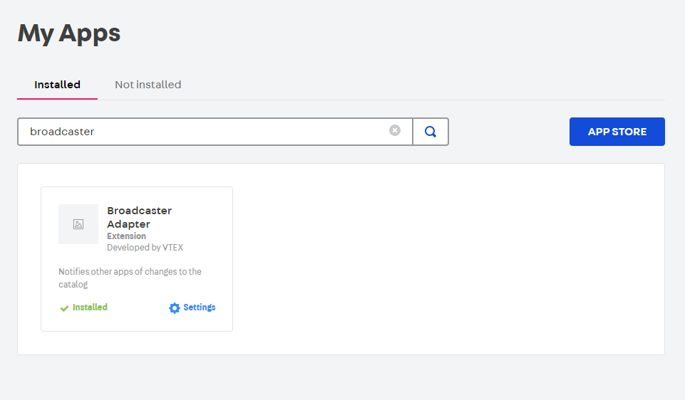

# Kit Indexer

App in VTEX that receives a notification when a SKU is changed, if the SKU changed is a KIT, the SKU is updated with the correct weight which is the sum of the weights of its components.

## How it works?

## How to install

⚠️ First, make sure the broadcaster app is installed.

Run command: `vtex install vtex.ki-739693`
